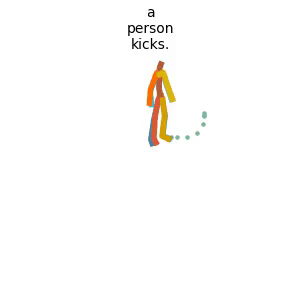

# Sketch2Anim: Towards Transferring Sketch Storyboards into 3D Animation
### [Project Page](https://zhongleilz.github.io/Sketch2Anim/) | [Paper](https://arxiv.org/pdf/2504.19189)

> Sketch2Anim: Towards Transferring Sketch Storyboards into 3D Animation

> [Lei Zhong](https://zhongleilz.github.io/), [Chuan Guo](https://ericguo5513.github.io/), [Yiming Xie](https://ymingxie.github.io),[Jiawei Wang](https://jiawei22.github.io/), [Changjian Li](https://enigma-li.github.io/)


## Citation
If you find our code or paper helpful, please consider starring our repository and citing:
```bibtex
@Article{Zhong:2025:Sketch2Anim, 
    Title = {Sketch2Anim: Towards Transferring Sketch Storyboards into 3D
    Animation}, 
    Author = {Lei Zhong, Chuan Guo, Yiming Xie, Jiawei Wang and Changjian Li}, 
    Journal = {ACM Transaction on Graphics (TOG)},
    volume={44},
    number={4},
    pages={1--15},
    Year = {2025}, 
    Publisher = {ACM New York, NY, USA} 
} 

```

## TODO List
- [x] Code for Inference and Pretrained model.
- [x] Evaluation code and metrics.
- [x] Code for training.
- [x] Blender Plugin.


## PRETRAINED_WEIGHTS
Available on [Google Drive](https://drive.google.com/drive/folders/12m_v_vybVeAQFkH9bP8wmJIxJhGoIJL1?usp=sharing).

## Getting started
This code requires:

* Python 3.9
* conda3 or miniconda3
* CUDA capable GPU (one is enough)

### 1. Setup environment

Install ffmpeg (if not already installed):

```shell
sudo apt update
sudo apt install ffmpeg
```
For windows use [this](https://www.geeksforgeeks.org/how-to-install-ffmpeg-on-windows/) instead.

Setup conda env:
```shell
conda env create -f environment.yml
conda activate sketch2anim
python -m spacy download en_core_web_sm
pip install git+https://github.com/openai/CLIP.git
```

Download dependencies:

```bash
bash prepare/download_smpl_files.sh
bash prepare/download_glove.sh
bash prepare/download_t2m_evaluators.sh
```


### 2. Get data

#### Full data (text + motion capture)

**HumanML3D** - Follow the instructions in [HumanML3D](https://github.com/EricGuo5513/HumanML3D.git),
then copy the result dataset to our repository:

```shell
cp -r ../HumanML3D/HumanML3D ./dataset/HumanML3D
```


### 3. Download the pretrained models

1. Download the pretrained model from [Google Drive](https://drive.google.com/drive/u/1/folders/13I35FWKw-HzUW87HTdBRwv5aOFrhYvEF) and then copy it to `./save/`.  

## 2D Sketch Motion Synthesis
Please add the content text to `./demo/demo.json`, then run:
```shell
bash demo.sh
```

Example output:



## Acknowledgments

Our code is heavily based on [MLD](https://github.com/ChenFengYe/motion-latent-diffusion) and [MotionLCM](https://github.com/Dai-Wenxun/MotionLCM).  
The motion visualization is based on [MLD](https://github.com/ChenFengYe/motion-latent-diffusion) and [TMOS](https://github.com/Mathux/TEMOS). 
We also thank the following works:
[guided-diffusion](https://github.com/openai/guided-diffusion), [MotionCLIP](https://github.com/GuyTevet/MotionCLIP), [text-to-motion](https://github.com/EricGuo5513/text-to-motion), [actor](https://github.com/Mathux/ACTOR), [joints2smpl](https://github.com/wangsen1312/joints2smpl), [MoDi](https://github.com/sigal-raab/MoDi), [HumanML3D](https://github.com/EricGuo5513/HumanML3D), [OmniControl](https://github.com/neu-vi/OmniControl).

## License
This code is distributed under an [MIT LICENSE](LICENSE).  

Note that our code depends on several other libraries, including SMPL, SMPL-X, and PyTorch3D, and utilizes the HumanML3D datasets. Each of these has its own respective license that must also be adhered to.
